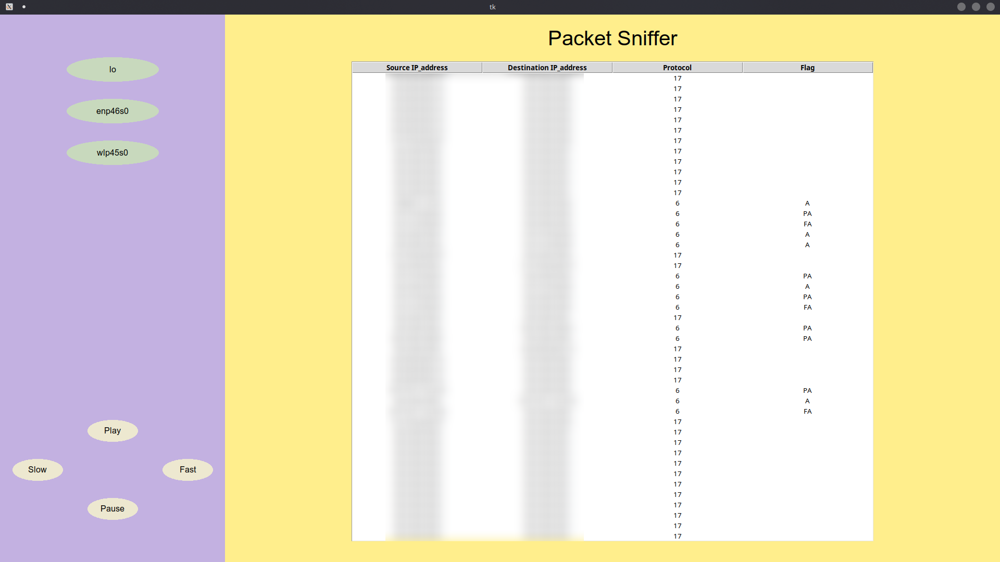

# Packet Sniffer

A lightweight network packet sniffer with a graphical interface built using Python, Tkinter, and Scapy. It captures live network traffic and displays source/destination IPs, protocol, and TCP flags in real time.

## Preview



## Features

- Auto-detects available network interfaces
- Displays live packets in a clean table (Source IP, Destination IP, Protocol, Flags)
- Adjustable capture speed (Slow / Fast)
- Cross-platform — works on Windows and Linux

## Requirements

- Python 3.10+
- Scapy

Install dependencies:
```bash
pip install -r requirements.txt
```

On Linux, if tkinter is missing:
```bash
sudo apt install python3-tk
```

# 3. Install dependencies
pip install -r requirements.txt

# 4. Run (requires admin/root for raw socket access)
sudo .venv/bin/python main.py    # Linux
python main.py                   # Windows (run terminal as Administrator)
```

## Why sudo?

Packet sniffing requires raw socket access, which is a privileged operation on both Linux and Windows. On Linux you need `sudo`, on Windows you need to run the terminal as Administrator.


